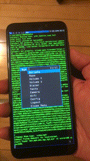

# **Sxmo**: Simple X Mobile

---

[Project Overview](https://sr.ht/~mil/Sxmo) | [Install Guide](https://git.sr.ht/~mil/sxmo-docs/tree/master/INSTALLGUIDE.md) | [User Guide](https://git.sr.ht/~mil/sxmo-docs/tree/master/USERGUIDE.md) | [Contributing](https://git.sr.ht/~mil/sxmo-docs/tree/master/CONTRIBUTING.md) | [Images](http://images.lrdu.org/) | [Demo Videos](http://media.lrdu.org/sxmo_pinephone_demos) | [Changelog](https://git.sr.ht/~mil/sxmo-docs/tree/master/CHANGELOG.md)

---

**Sxmo**, or Simple X Mobile, is a collection of simple and [suckless](http://suckless.org) X programs and scripts used together to create a fully functional mobile UI adhering to the [Unix philosophy](https://en.wikipedia.org/wiki/Unix_philosophy) for the [Pinephone](https://www.pine64.org/pinephone/). You control the UI largely through using the Pinephone buttons (press different numbers of times quickly for different actions) and swipe gestures.

Overview of Sxmo's features:

- **Pinephone buttons actions**: (via [dwm](http://git.sr.ht/~mil/sxmo-dwm)) press hardware buttons different number of times for different actions (like launching terminals, browsers, and window management)
- **Swipe gestures**: (via [lisgd](http://git.sr.ht/~mil/lisgd)) move between workspaces, move windows between workspaces, and raise/lower volume via swipe gestures
- **Menu interfaces**: (via [dmenu](http://git.sr.ht/~mil/sxmo-dmenu)) use the Pinephone hardware buttons to select menu entries (e.g. volume up/volume down/select translates to previous/next/select)
- **Onscreen keyboard**: (via [svkbd](http://git.sr.ht/~mil/sxmo-svkbd)) Multiple layer responsive onscreen keyboard that autoadjusts WM space
- **Window Managment**: (via [dwm](http://git.sr.ht/~mil/sxmo-dwm)) Arrange windows (in classic dwm layouts like monocle, tile, and bstack), kill clients, and cycle window focus using Pinephone buttons
- **Calls & Texting**: (via [dmenu scripts/mmcli](https://git.sr.ht/~mil/sxmo-utils/tree/master/scripts/modem)) Compose texts in $EDITOR / vim-like editor, read texts in $PAGER, make calls (and audio-route) via dmenu script utilizing modemmanager
- **Incoming Text/Call notifications**:  (via [script](https://git.sr.ht/~mil/sxmo-utils/tree/master/scripts/modem/sxmo_modemmonitor.sh)) Vibrate phone & blink led when there is an incoming call/text
- **Lock Screen**: (via [custom C program](https://git.sr.ht/~mil/sxmo-utils/tree/master/programs/sxmo_screenlock.c)) Disable screen input and toggle screen on/off for listening to music / pocket use
- **Menu Scripts**: Web Search, Files, Countdown Timer, Youtube audio and video (mpv-based), Weather, RSS
- **Web browser**: (via [surf](http://git.sr.ht/~mil/sxmo-surf)) Browse the web while saving screenspace and includes Pinephone buttons (via dmenu) based link-following
- **Terminal**: (via [st](http://git.sr.ht/~mil/sxmo-st)) Excellent terminal support with scrollback, copy-paste, and color invert
- **Other Applications**: Prebaked images bundle foxtrotgps (GPS), sacc (Gopher client), Firefox and Netsurf (web browsers)
- **System-menus**: Control Volume, Brightness, Camera, Wifi, Logout, Modem Info, Launching Apps, and more
- **Application-specific menus**: Increase font-size, zoom, paste, on per-application level via dmenu scripts
- **Login Screen**: (via [xdm](https://en.wikipedia.org/wiki/XDM_(display_manager))) Login/logout via XDM which launches with onscreen keyboard
- **Alpine Linux / PmOS Based Images**: Our infrastructure bakes images that live ontop of PmOS/Alpine Linux which keeps things small, simple, and pragmatic
