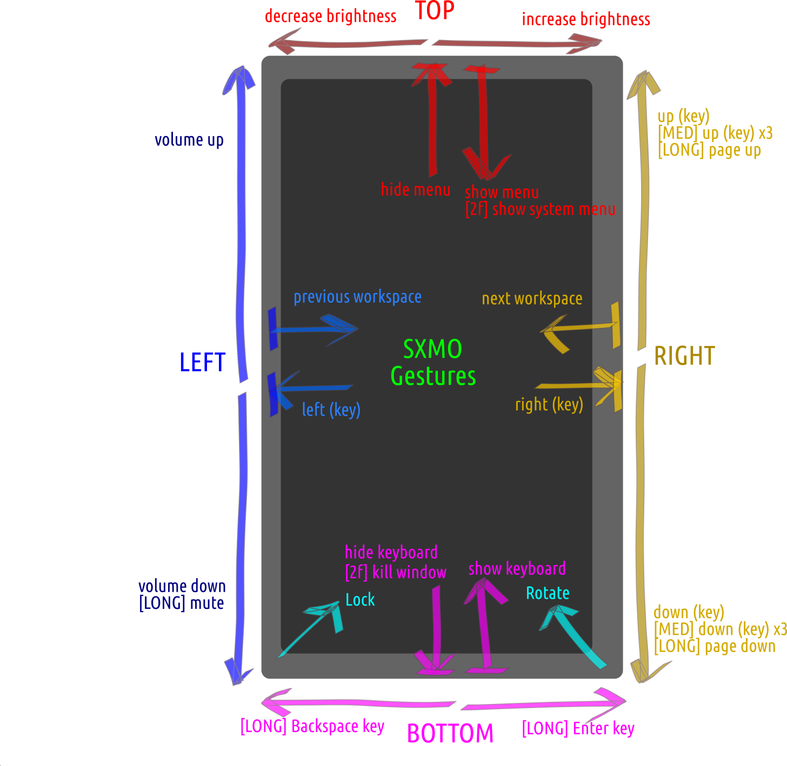

# **Sxmo**: Simple X Mobile - *User Guide*

---

[Project Overview](https://sr.ht/~mil/Sxmo) | [Install Guide](https://git.sr.ht/~mil/sxmo-docs/tree/master/INSTALLGUIDE.md) | [User Guide](https://git.sr.ht/~mil/sxmo-docs/tree/master/USERGUIDE.md) | [Contributing](https://git.sr.ht/~mil/sxmo-docs/tree/master/CONTRIBUTING.md) | [Images](http://images.lrdu.org/) | [Demo Videos](http://media.lrdu.org/sxmo_pinephone_demos) | [Changelog](https://git.sr.ht/~mil/sxmo-docs/tree/master/CHANGELOG.md)

---

**Table of Contents:**

- [Global UI Controls](#strongglobal-ui-controlsstrong)
- [The Menu System](#strongthe-menu-systemstrong)
- [Included Menus](#strongincluded-menusstrong)
- [Status Bar](#strongstatus-barstrong)
- [Screenlock](#strongscreen-lockstrong)
- [Calls and Texting](#strongcalls-and-textingstrong)
- [Included Scripts and Applications](#strongincluded-scripts-and-applicationsstrong)
- [Wifi](#strongwifistrong)
- [Audio Routing](#strongaudio-routingstrong)
- [Resize SD Card Size](#strongresize-sd-card-sizestrong)
- [Updating and Changelog](#strongupdating-and-changelogstrong)
- [User Customizable Functionality](#stronguser-customizable-functionalitystrong)

## **Global UI Controls**

**Button Bindings**

The core of the Sxmo UI is based on the [dwm](http://dwm.suckless.org) window manager patched with
(among other patches), the [multikey](https://dwm.suckless.org/patches/multikey/) patch. This patch allows dwm to
recognize rapid successive (e.g. double/triple clicks) button presses to
trigger different actions. The three hardware buttons on the Pinephone
thus can trigger 9 different actions.

The default button bindings are:

- **Volume Raise**:
  - **1 tap**: Launch [application-specific context menu](#strongincluded-menusstrong)
  - **2 taps**: Launch [global system menu](#strongincluded-menusstrong)
  - **3 taps (or hold)**: Activate [screen lock](#strongscreen-lockstrong)
- **Volume Lower**:
  - **1 tap**: Toggle dwm layout algorithm (between monocle/tile/bstack)
  - **2 taps**: Shift current client in stack
  - **3 taps (or hold)**: Kill client
- **Powerkey**:
  - **1 tap**: Toggle svkbd onscreen keyboard
  - **2 taps**: Launch st (terminal)
  - **3 taps (or hold)**: Launch surf (browser)


**Swipe gestures**

In addition to the button bindings provided through dwm, a custom application
called [lisgd](http://git.sr.ht/~mil/lisgd) was developed to provide
touchscreen swipe gestures within Sxmo. These gestures are sensitive to the edge of the screen where the gesture is initiated
or where they end up, and some are sensitive to the length/distance of the swipe. Gestures in the main part of the
screen, staying clear of the edges, are usually not interpreted and passed to the underlying application unmodified
(assuming it has gesture support).

The SXMO gestures are visualized in the following schematic:



The default swipe gestures are:

  - **1 finger Right-to-Left from Right edge**: Focus next tag/workspace
  - **1 finger Left-to-Right from Left edge**: Focus previous tag/workspace
  - **2 fingers Right-to-Left (anywhere)**: Move focused application to previous tag/workspace
  - **2 fingers Left-to-Right (anywhere)**: Move focused application to next tag/workspace
  - **1 finger Top-to-Bottom along the Left edge**: Volume down (long swipe: mute)
  - **1 finger Bottom-to-Top from the Top edge**: Show the application menu
  - **2 finger Bottom-to-Top from the Top edge**: Show the system menu
  - **1 finger Top-to-Bottom onto the Top edge**: Close the active menu
  - **1 finger Bottom-to-Top from the Bottom edge**: Show virtual keyboard
  - **1 finger Top-to-Bottom onto the Bottom edge**: Hide virtual keyboard
  - **2 finger Top-to-Bottom onto the Bottom edge**: Kill the current active window
  - **1 finger from Bottom-Right corner, swiping diagonally**:  Rotate the screen
  - **1 finger from Bottom-Left corner, swiping diagonally**:  Lock the device
  - **1 finger Left-to-Right along the top edge**: Increase screen brightness
  - **1 finger Right-to-Left along the top edge**: Decrease screen brightness

There are various default gestures that translate to keypresses for the underlying application,
this facilitates navigation in a variety of applications, including terminal-based applications, without needing the
virtual keyboard:

  - **1 finger Right-to-Left onto the Left edge**: Send Left arrow
  - **1 finger Left-to-Right onto the Right edge**: Send Right arrow
  - **1 finger Top-to-Bottom along the Right edge**: Send Key down (long swipe: Page down)
  - **1 finger Bottom-to-Top along the Right edge**: Send Key up (long swipe: Page up)
  - **1 finger Right-to-Left along the Bottom edge**: Send Backspace
  - **1 finger Left-to-Right along the Bottom edge**: Send Return

**Important note**: earlier versions of Sxmo prior to 1.2.0 used different gestures, if you are not on 1.2.0 yet you
won't have the above gestures yet but these old ones:

-  - **1 finger R-to-L**: Focus next tag
-  - **1 finger L-to-R**: Focus previous tag
-  - **1 finger LD-to-RU**: Increase volume
-  - **1 finger RU-to-LD**: Decrease volume
-  - **1 finger RD-to-LU**: Increase brightness
-  - **1 finger LU-to-RD**: Decrease brightness
-  - **2 fingers R-to-L**: Move focused application to next tag
-  - **2 fingers L-to-R**: Move focused application to previous tag
-  - **2 fingers D-to-U**: Launch onscreen keyboard, svkbd
-  - **2 fingers U-to-D**: Close onscreen keyboard, svkbd


## **The Menu System**

Menus are a central feature of Sxmo and are navigable through using
the Pinephone's 3 hardware buttons. Also you can use the touchscreen
to tap your selection if you'd like as well. The menus are essentially
scripts around a custom patched version of [dmenu](http://tools.suckless.org/dmenu). Note
that while using a menu, dwm's [button bindings](#strongglobal-ui-controlsstrong) won't be triggered as
these grab's are setup to be mutually exclusive from X's point of view.

The default menu bindings for the Pinephone buttons are:

- **Volume Raise**: Previous item
- **Volume Lower**: Next item
- **Power**: Select item


## **Included Menus**

**1. Application-specific context menus**

The application-specific context menu (triggered by single tapping the volume
raise key) lets you you access application-specific features of the currently
focused window. For example while using mpv, the application-specific
context menu lets you pause the video, increase/decrease volume, seek, etc.
You can reference the [sxmo_appmenu.sh](https://git.sr.ht/~mil/sxmo-utils/tree/master/scripts/core/sxmo_appmenu.sh) script for a full list of functionality.

**2. Global system menu (Sys)**

The global system menu (triggered by double tapping the volume raise button)
lets you launch applications, toggle system preferences and more. This is
probably the closest thing to 'homescreen' in traditional phone OS's in
that it can be the starting point to access much of the functionality
in Sxmo. This menu lets you:

- Launch [Scripts and Applications](#strongincluded-scripts-and-applicationsstrong)
- Adjust volume
- Make/Receive [Calls and Texts](#strongcalls-and-textingstrong)
- Launch the Camera
- Connect to Wifi
- Adjust audio output device

**3. Global config menu (Config)**

The global config menu is accessible by launching the global system menu
aforementioned and selecting *Config*. This menu let you:

- Adjust system brightness
- Toggle modem monitoring, view modem information and the modem log
- Rotate the screen rotation
- Upgrade packages


## **Status Bar**

The status bar located at the top will look something like:

```
1 2 3 4 []= Vis                M W S26 D67% 00:56
```

1,2,3,4 are the various workspaces that you have. Tapping one of these numbers will take you to that workspace.

### **Layouts**
DWM is a dynamic window manager with a master-slave stack layout.
As such, the window manager automatically decides where windows should be placed.
The algorithm used to decide where windows should be placed is governed by the icon to the right of the 4th workspace icon.
Open some windows and you should get an understanding of the various layouts.
By default, the layout is set to "[]=" and tapping icon representing the current layout will cycle through the available layouts.

When the "[ ]" layout is active, the number of open windows is displayed in the [ ].
This layout will only show one window that takes up the entire workspace.
By tapping the left and right hand side of the title bar, you can cycle back and forth between the windows that are open.

For more info on DWM and other layouts that you can patch in, see the [upstream website for dwm](https://dwm.suckless.org/).

### **Modem**
If you are in a call, the length of the call will be display adjacent to the title bar (Vis in the example status bar shown).

The M in the title bar will appear when your modem is active and you will receive incoming calls and texts.
The W in the title bar will appear when your wifi is active.

### **Sound**

The title bar will show which audio output is active with S<INT> (speaker active), H<INT> (headphones active), or E<INT> (earphone active).

The <INT> value is how loud a given output is set.

### **Battery**

The titlebar will show D<INT>% if the battery is not charging or C<INT>% if the battery is charging.

The <INT> value shows what percentage of the battery is filled.

### **Time**

The time is shown in 24 hour format as the last item in the status bar.

## **Screen Lock**

A custom application ([sxmo_screenlock](https://git.sr.ht/~mil/sxmo-utils/tree/master/programs/sxmo_screenlock.c))
enables you to lock the screen so no tap events are processed. This application
also allows you to enter suspend (deep sleep / CRUST). You can activate the
screen lock by tapping the volume raise key three times quickly or holding the
volume raise key down.  You will see the Pinephone's blue LED indicator activate.

The Screenlock has three modes:

- **Screenlock display on mode**: Locks the screen and disables input; but keeps the screen on
  - Indicated by blue LED
- **Screenlock display off mode**: Locks the screen, disables input, and turns the screen off
  - Indicated by purple LED
- **Screenlock deep sleep mode**: Enters CRUST suspend / deep sleep
  - Indicated by red LED

While using the Screenlock, only the following bindings apply
(and override the [default dwm button bindings](#strongglobal-ui-controlsstrong)):

- **Volume Raise**:
  - **3 taps**: Enter screenlock deep sleep mode
- **Volume Lower**:
  - **3 taps**: Toggle between screenlock display on/off mode
- **Powerkey**:
  - **3 taps**: Exit screen lock

When you are in deep sleep mode (entered by tapping volume raise 3 times), you
can exit this mode and restore the above bindings by clicking the powerkey once.
After exiting deep sleeep mode, within 5 seconds  you should either press the
volume lower or powerkey 3 times to switch modes or exit. After 5 seconds, the
blinking stops and you will be kicked back into deep sleep mode. The purpose of
this 5 second timeout is so that if you accidently press the powerkey when the
phone is in your pocket, you won't inadvertently be kicked out of CRUST.

You can set the environment variable SXMO_RTCWAKEINTERVAL to an integer indicating an interval (in seconds) when to
temporarily wake the phone from sleep. You can use this period to receive notifications and optionally execute your own
``rtcwake`` hook script. During this wake interval, the led will be blue and purple again when suspension is
about to start.

## **Calls and Texting**

Calling and texting is fully functional and should work out-of-the-box. Make
sure you have the modem killswitch in the enabled position and wait a little
bit after booting before trying modem functionality to allow the modem to
connect.

Modem functionality is based on using the [dmenu menu system](#strongthe-menu-systemstrong)
and accessible through the [global system menu](#strongincluded-menusstrong).
The scripting behind the scenes works via [ModemManager](https://www.freedesktop.org/wiki/Software/ModemManager/) using the [mmcli](https://www.freedesktop.org/software/ModemManager/man/1.0.0/mmcli.8.html) command line tool.

**Calling**

To place a new call, you can use the *Dialer* entry in the [global system menu](#strongincluded-menusstrong).
You will be prompted for a number to dial. Once the call connects, a menu
will automatically be launched which let's you:

- Manage audio routing
- Send DTMF (dial) tones
- Hang up the call
- Lock the screen (via [screen lock](#strongscreen-lockstrong))

**Texting**

To view existing text message threads you can use the *Texts* entry in the
[global system menu](#strongincluded-menusstrong).  This menu will let
you tail follow a logfile for your conversation with each number. When
a new text is sent or received; the tail will automatically be updated
with the new text contents.

To compose a new text message, from the *Texts* entry you will see a
*Send a Text* entry which first prompt you for a number. After entering
the destination number you will be dropped into a vim-like editor
([vis](https://github.com/martanne/vis)) to compose your message. Once
your message is as you'd like it, exit the editor using `ZZ`/`:w`/or
by holding down (or triple clicking) the volume down key.  You will
now be taken to a new menu to confirm your message from which you can
edit/send/cancel the message.

**Monitoring for Incoming Calls/Texts**

A vital feature of a working phone is being able to receive new texts and
pickup calls. This functionality is made possible through a script that
monitors the modem every few seconds for new activity and vibrates the
phone and blinks the green LED when there is an incoming text/call. This
functionality is optional and can be toggled on/off (e.g. to have a
'silent' mode) via the [Config menu](#strongincluded-menusstrong). By
default the modem monitoring is set to off. You can tell if modem
monitoring is on as there will be an "M" icon that appears in dwm's bar.

While a call is incoming:

- The vibration motor will trigger for 3 seconds
- The green LED will trigger
- To pickup the call, open either the [global or application](#strongincluded-menusstrong) menu and you'll
  see a menu entry to pickup the call; of course this is timesensitive and this
  menu entry will only be visible while the other party's line is ringing

When a new text message comes in:

- The vibration motor will trigger rapidly in 3 intervals for 300ms
- The green LED will trigger
- To view the new text message, refer to the **Texting** section above

**Contacts System**

The Sxmo contacts system based on a plain TSV file that can be placed at
`$XDG_CONFIG_HOME/sxmo/contacts.tsv`.  This TSV file is expected to have
two columns: phonenumber, and contactname. Upon receiving a call if you
have a contact stored associated with the incoming number, the contact
name will appear instead of the number. Also contact names will appear
in the Texts and Dialer menus if they are present in the contacts TSV
file. If no `contacts.tsv` is present, or the number is missing from
this file; the contact in menus will show up as `Unknown Number`.
An `contacts.tsv` example might look like:

```
+122345628	John Smith
+128371642	Jeff Foo
+31612345678	Jan Janssen
```

**International Numbers**

Note that you should **always** prefix numbers you call out with, text to,
or add to the contact system **with their international prefix code**
and **with** the initial plus sign. Behind the scenes for `mmcli`, numbers always
come into the system with international prefixes from my testing. So if
you receieve a call from the number `54321` for example; it would come
into mmcli as `+154321` if this was a US number. This means if you dial, text, and store contacts *with
the internationl prefix*, you can be assured that texts / outgoing /
incoming calls will line up in regards to deduplication of contacts in
menus and text message threads will stay intact.


## **Included Scripts and Applications**

In the [global system menu](#strongincluded-menusstrong) there are entries for both applications and
scripts.

**Included Scripts:**

- **Web Search**: Search duckduckgo with the query provided by the user (bangs work too)
- **Files**: A filebrowser that can handle opening audio and text files
- **Timer**: A simple countdown timer script that vibrates the phones upon completion
- **Youtube**: Search youtube by keyword in dmenu and then view in mpv (script based on [idiotbox](https://codemadness.org/idiotbox.html))
- **Youtube (audio)**: Search youtube by keyword in dmenu and then listen in mpv (script based on [idiotbox](https://codemadness.org/idiotbox.html))
- **Weather**: United States weather forecast (by zipcode) dmenu script
- **RSS**: Aggregates RSS feeds and let's you view by timespan dmenu script (based on [sfeed](https://codemadness.org/sfeed-simple-feed-parser.html))

**Included Applications:**

- **Surf**: The suckless minimalistic browser based on Webkit
- **Netsurf**: An alternative minimalistic browser that renders really fast
- **Firefox**: The infamous FOSS browser often symbolized by a fox
- **Sacc**: A great minimalistic gopher browser; launches by default to a good phlog aggregator
- **W3m**: A text-based browser with vim-like keybindings
- **Xcalc**: A nice (and fast) calculator app
- **St**: The suckless terminal
- **Foxtrotgps**: A minimal GPS application to help you navigate the world

## **Wifi**

At the time being the primary way to get connected to the Internet in Sxmo
is through wifi. There is a menu entry in the [global system menu](#strongincluded-menusstrong) to connect
to wifi. This is essentially this is just a wrapper to launch `nnmtui`. Make sure
the killswitch for Wifi on your Pinephone is in the enabled position.

Mobile data should be manually for now (there is no built in menu to do this);
so refer to [postmarketos](https://wiki.postmarketos.org/wiki/PINE64_PinePhone_(pine64-pinephone)#Modem) pinephone documentation for that aspect.

## **Audio Routing**

You can use the Audio entry in the [global system menu](#strongincluded-menusstrong)
to toggle which audio output you want to send sound to.

Note that when in a call, the audio device selected in the global system menu
won't automatically apply; rather audio will automatically be initially routed
to the earpiece and then changeable through the in call menu. Upon the call
ending, audio is always routed back to the headphone jack.

## **Updating and Changelog**

Sxmo's packages are currently distributed through packages in pmOS so
when new package versions are periodically pushed; your install can be

To update run:

```
apk update
apk upgrade
```

There is also a menu entry within the [Config menu](#strongincluded-menusstrong)
to update as well which runs the same commands as above.

For details on what changed between package versions or image releases
refer to [the changelog](https://git.sr.ht/~mil/sxmo-docs/tree/master/CHANGELOG.md).

## **User Customizable Functionality**

**Files and Folders**

<table>
  <tbody>
    <tr>
      <td><strong>Filepath</strong></td>
      <td><strong>Description</strong></td>
    </tr>
    <tr>
      <td>$XDG_CONFIG_HOME/sxmo/xinit</td>
      <td>Automatically executed script executed upon starting X.</td>
    </tr>
    <tr>
      <td>$XDG_CONFIG_HOME/sxmo/conky.conf</td>
      <td>Your own custom conky.conf (for displaying the clock etc), overrides the default when present.</td>
    </tr>
    <tr>
      <td>$XDG_CONFIG_HOME/sxmo/contacts.tsv</td>
      <td>
        <p>TSV file wherein each row is: contactnumber TAB contactname</p>
        <p>If unset all contacts will show up as 'Unknown Number'</p>
        <p>All phone numbers must be full phone numbers startings with + and the country code</p>
      </td>
    </tr>
    <tr>
      <td>$XDG_CONFIG_HOME/sxmo/sfeedrc</td>
      <td>Sfeedrc file (see <a href="https://codemadness.org/git/sfeed/file/README.html">sfeed documentation</a> used by RSS script)</td>
    </tr>
    <tr>
      <td>$XDG_CONFIG_HOME/sxmo/userscripts</td>
      <td>Directory to place user scripts which will automatically appear in the menu system</td>
    </tr>
    <tr>
      <td>$XDG_CONFIG_HOME/sxmo/hooks/ring</td>
      <td>
	<p>Executable script to run when the phone is receiving a call / rings</p>
	<p>This script is called with "$1" set to the incoming number and contact name.</p>
      </td>
    </tr>
    <tr>
      <td>$XDG_CONFIG_HOME/sxmo/hooks/sms</td>
      <td>
	<p>Executable script to run when the phone is receiving a text</p>
	<p>This script is called with "$1" set to the incoming number and contact name.</p>
      </td>
    </tr>
    <tr>
      <td>$XDG_CONFIG_HOME/sxmo/hooks/apps</td>
      <td>Executable script to run when display of the app menu is requested, outputs to stdout and allows you to override the default app
      menu (see sxmo_appmenu.sh)</td>
    </tr>
    <tr>
      <td>$XDG_CONFIG_HOME/sxmo/hooks/scripts</td>
      <td>Executable script to run when display of the scripts menu is requested, outputs to stdout and allows you to override the default app
      menu (see sxmo_appmenu.sh)</td>
    </tr>
    <tr>
      <td>$XDG_CONFIG_HOME/sxmo/hooks/presuspend</td>
      <td>Executable script that is executed prior to suspending the device. If the exit code of this script is
      non-zero, suspend will be cancelled</td>
    </tr>
    <tr>
      <td>$XDG_CONFIG_HOME/sxmo/hooks/postwake</td>
      <td>Executable script that is executed after waking from suspension. </td>
    </tr>
    <tr>
      <td>$XDG_CONFIG_HOME/sxmo/hooks/rtcwake</td>
      <td>Executable script that is executed every time the device temporarily wakes. You can use this script to check notifications from whatever back-end you desire. The temporary wake interval (in seconds )can be configured using the environment variable $SXMO_RTCWAKEINTERVAL . If this script exits with a non-zero exit code, suspension will be cancelled.</td>
    </tr>
    <tr>
      <td>$XDG_CONFIG_HOME/sxmo/hooks/lock</td>
      <td>Executable script that is executed prior to locking the device</td>
    </tr>
    <tr>
      <td>$XDG_CONFIG_HOME/sxmo/hooks/unlock</td>
      <td>Executable script that is executed immediately after unlocking the device</td>
    </tr>
    <tr>
      <td>$XDG_CONFIG_HOME/sxmo/hooks/lisgdstart</td>
      <td>Script that is executed to start the gesture deamon, overrides the defaults (see ``sxmo_lisgdstart.sh``). This
      allows defining custom gestures.</td>
    </tr>
    <tr>
      <td>$XDG_CONFIG_HOME/sxmo/hooks/gesture</td>
      <td>Script that is executed when a gesture is to be interpreted. It is passed the WM_CLASS of the active window as
      first parameter and the identifier/name of the gesture (or command to run) in the second argument, as configured with lisgd. See
      ``sxmo_gesturehandler.sh`` for details. This script allows you to define your own context-sensitive (i.e. application
      specific) gestures.
      </td>
    </tr>
	<tr>
		<td> $XDG_CONFIG_HOME"/sxmo/hooks/notification</td>
		<td>This script will run whenever any kind of notification is received. It can be used for example to blink the
		led if you want to override the default behaviour</td>
	</tr>
  </tbody>
</table>

Note: `$XDG_CONFIG_HOME` by default is equal to `~/.config`

**Environment Variables**

The following enviroment variables can be set:

<table>
  <tbody>
    <tr>
      <td><strong>Environment variable</strong></td>
      <td><strong>Description</strong></td>
    </tr>
    <tr>
      <td>$TERM</td>
      <td>Terminal to launch on double-clicking power button and used in scripts. Defaults to `st`.</td>
    </tr>
    <tr>
      <td>$BROWSER</td>
      <td>Browser to launch on triple-clicking/holding power-button and used in scripts. Defaults to `surf`.</td>
    </tr>
    <tr>
      <td>$KEYBOARD</td>
      <td>Keyboard to launch on single-clicking power button and used in scripts. Defaults to `svkbd-mobile-intl` or `svkbd-sxmo`</td>
    </tr>
    <tr>
      <td>$EDITOR</td>
      <td>Editor to use to handle files (partial support; full support plans for composing texts etc). Defaults to `vis`.</td>
    </tr>
    <tr>
      <td>$SXMO_RECDIR</td>
      <td>Directory that the Record script will save recordings to.</td>
    </tr>
    <tr>
      <td>$SXMO_SUBREDDITS</td>
      <td>Subreddits (comma-separated) to appear in menu for Reddit script.</td>
    </tr>
    <tr>
      <td>$SXMO_GPSLOCATIONSFILES</td>
      <td>
        <p>Files of GPS coordinates to populate the locations menu in the foxtrotgps menu.</p>
        <p>Each file is expected to be a tsv; the first entry being the location; the second being lat, lon pair.</p>
      </td>
    </tr>
    <tr>
      <td>$SXMO_RTCWAKEINTERVAL</td>
      <td>Integer specifying the interval in second for a temporary wake when suspended (e.g. to check notifications). Set to 0 to disable (default)</td>
    </tr>
    <tr>
      <td>$SXMO_LOCK_SCREEN_OFF</td>
      <td>Boolean, set to 1 to to immediately turn the screen off upon locking (this skips the default first stage)</td>
    </tr>
    <tr>
      <td>$SXMO_LOCK_SUSPEND</td>
      <td>Boolean, set to 1 to to immediately suspend the device upon locking (this skips the default first two stages)</td>
    </tr>
    <tr>
        <td>$SVKBD_ENABLEOVERLAYS</td>
        <td>Boolean, set to 0 to disable the overlay functionality on the virtual keyboard (svkbd) (enabled by default), the overlay
        functionality is responsible for showing input variations such as diacritics when holding a key with a long press.</td>
    </tr>
    <tr>
        <td>$SVKBD_LAYERS</td>
        <td>Comma separated list of layers to enable on the virtual keyboard. See the svkbd source for your layout for a
        definition of available layers.</td>
    </tr>
    <tr>
        <td>$SVKBD_HEIGHTFACTOR</td>
        <td>Integer value expressing a height fraction, a one key row of the virtual keyboard takes 1/x of the screen height.</td>
    </tr>
  </tbody>
</table>

**User-customizable xinitrc**

For setting the above Enviroment Variables and also to launch custom
programs upon starting X you can use the user customizable `xinit`
described in the Files and Folders section.  An example you might use
to get started could look like:

```sh
#!/usr/bin/env sh
# Launch firefox instead of surf triple-clicking/holding down powerdown
export BROWSER=firefox

# Prepopulate Subreddits menu with custom subreddits
export SXMO_SUBREDDITS="asmr unixporn wtf"

#Temporarily wake every 5 minutes during sleep
export SXMO_RTCWAKEINTERVAL=300

# Launch st that says hello world on starting enviroment
st -e sh -c 'echo hello world!; read' &
```

Place the contents above into `~/.config/sxmo/xinit` and restart X and
customize away.

**User Scripts**

User scripts are custom scripts the user can run via the [global
system menu](#strongincluded-menusstrong). To add your own custom
userscript, create the `$XDG_CONFIG_HOME/sxmo/userscripts` directory
and place your `.sh` scripts in the `userscripts` directory. If the
`userscripts` folder is populated with atleast one script, a new
menu item called `Userscripts` will appear in the [global system
menu](#strongincluded-menusstrong). Note, Userscripts should be set to
be executable.

For examples of scripts Sxmo users have made for their mobile devices, see:

- [~anjan/sxmo-userscripts](https://git.sr.ht/~anjan/sxmo-userscripts).

**Further Customization**

Much of Sxmo's core-functionality in regards to menus
are built out via plain shell scripts. So further
cutomization should be simple. See sxmo-util's [scripts
directory](https://git.sr.ht/~mil/sxmo-utils/tree/master/scripts)
to get a better sense of how things are put together. You can edit
the scripts on your system for temporary fixes and please consider
[contributing](https://git.sr.ht/~mil/sxmo-docs/tree/master/CONTRIBUTING.md)
your changes if you believe your modifications may be useful to other
users.
